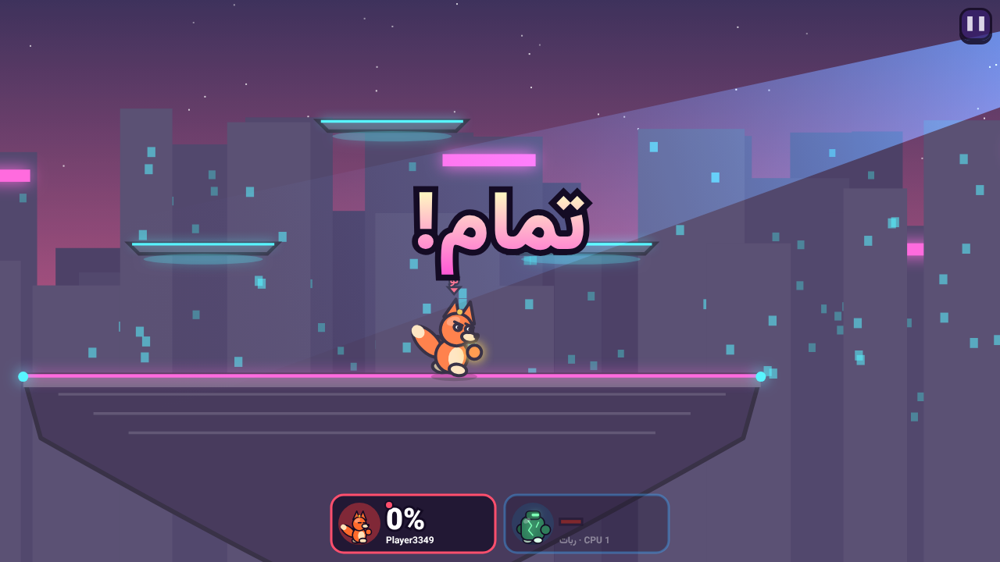

# Neon Brawl — نئون براول

Online 2D platform fighter (Smash-style) for **Myket** and **Google Play**, with ranked matchmaking, a full economy, AdMob/Tapsell ads and in-app purchases.
Full game design document (Persian): **[docs/GDD.md](docs/GDD.md)**.

```
shared/   deterministic game simulation, fighters, stages, AI, economy, ranking, net protocol (used by server AND client)
server/   Node.js authoritative game server: WebSocket matches (60 Hz), matchmaking, rooms, REST economy API, IAP verification
client/   HTML5 Canvas game + DOM UI (Vite), Capacitor Android wrapper, ads/billing services
client/plugins/   native Capacitor plugins: Tapsell Plus (ads) and Myket billing
```

## Run locally

```bash
npm install
npm run dev            # server on :8787 + client on :5173 (proxied)
# or a single process serving the built client:
npm run build && npm start   # http://localhost:8787
```

Offline: if the server is unreachable the client falls back to a local profile (VS CPU, training, shop with the same rules).

Tests: `npm test` (sim/economy unit tests + server end-to-end: matchmaking, forfeit, rooms, IAP). Typecheck: `npm run typecheck`.

## Server configuration (env)

| var | meaning |
|---|---|
| `PORT` | default 8787 |
| `DATA_DIR` | JSON database directory (default `server/data`) |
| `NODE_ENV=production` | disables sandbox purchases |
| `GP_PACKAGE`, `GP_SERVICE_ACCOUNT` | Google Play package + service-account JSON (Android Publisher API) |
| `MYKET_PACKAGE`, `MYKET_ACCESS_TOKEN` | Myket package + developer API token (`MYKET_VERIFY_URL` to override the endpoint) |

Put it behind HTTPS (nginx/Caddy) — native builds need `https://` / `wss://`.

## Android builds

```bash
cd client
# edit .env.myket / .env.googleplay: VITE_SERVER_URL, ad unit/zone ids, Myket RSA key
npx cap add android                 # once
npm run android:myket               # or android:googleplay
npx cap open android                # build the signed AAB/APK in Android Studio
```

* **Google Play build** → AdMob (`@capacitor-community/admob`, set your real app id in `capacitor.config.ts`) + Play Billing (`cordova-plugin-purchase`).
* **Myket build** → Tapsell Plus + Myket billing (local plugins in `client/plugins`, picked up by `cap sync`).
* Create the in-app products in each console with the SKUs listed in `shared/src/economy.ts` (`IAP_PRODUCTS`).
* The default AdMob ids are Google's **test** ids — replace before release.

> The native plugin Java code and Gradle versions (Tapsell Plus, Myket billing client) follow the vendors' documented APIs but were not compiled in this environment; check the versions against the current Tapsell/Myket docs on first build.

## Screenshots

| | |
|---|---|
|  |  |
|  |  |
|  |  |
